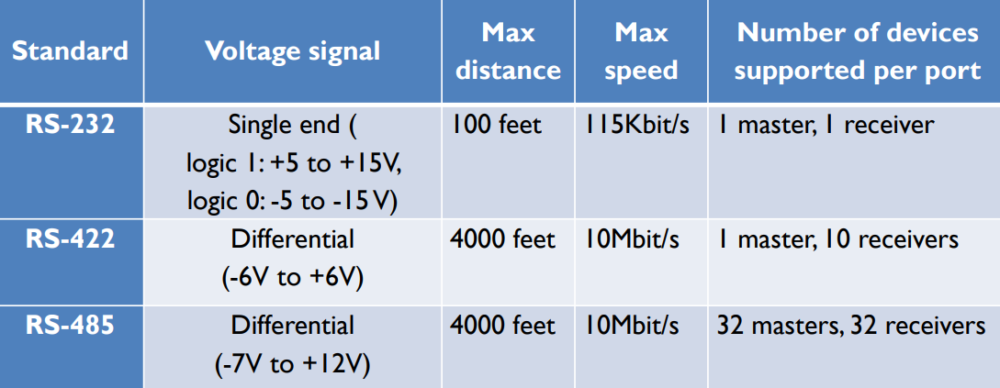
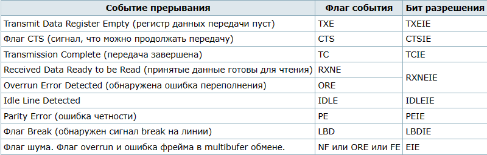
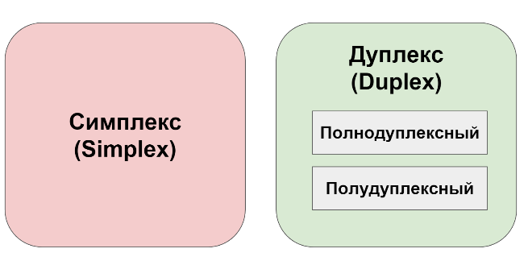
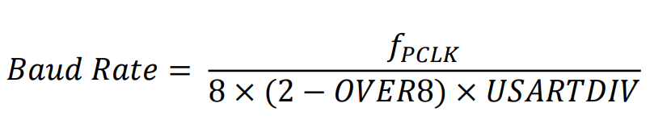
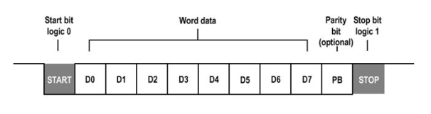

# USART (universal synchronous asynchronous receiver transmitter)

Микроконтроллер STM32F4 имеет несколько  универсальных СИНХРОННЫХ/АСИНХРОННЫХ модулей приемо-передатчика USART. То есть модуль может работать как в синхронном режиме (с синхронизацией), так
и в асинхронном (без синхронизации) Для работы в синхронном режиме, кроме вывода приема RXD (PD0) и вывода передачи TXD (PD1), необходим дополнительный вывод тактирования XCK (PD2). В подавляющем большинстве случаев, нет необходимости усложнять аппаратную и программную части устройства, использованием модуля в синхронном режиме. Поэтому СИНХРОННЫЙ/АСИНХРОННЫЙ модуль приемо-передатчика USART чаще всего настраивают на работу в асинхронный режим. Модуль, который может работать только в асинхронном режиме, называется UART.

Прием и передача происходит по **стандартному асинхронному протоколу передачи данных**

> Впервые протокол был описан стандартом RS-232 (описание процесса передачи данных)
> 

Интерфейс обычно подключается к внешним системам тремя ножками. Любой двунаправленный обмен UART требует как минимум двух сигнальных выводов: входные принимаемые данные (Receive Data In, RX) и выходные передаваемые данные (Transmit Data Out, TX)

Соответственно, двусторонняя связь между двумя устройствами будет только тогда, когда вывод передатчика первого устройства соединен с выводом приемника второго устройства, а вывод приемника первого устройства соединен с выводом передатчика второго устройства. **То есть соединение должно быть крест-накрест**.

FTD1213 преобразует порт UART в USB interface

</

## Способы связи

</

**ВСЕ НАСТРОЙКИ ПАРАМЕТРОВ СВЯЗИ НА УСТРОЙСТВАХ, МЕЖДУ КОТОРЫМИ ОСУЩЕСТВЛЯЕТСЯ ОБМЕН ДАННЫМИ (МК И КОМПЬЮТЕР ИЛИ МК И МК ИЛИ КОМПЬЮТЕР И КОМПЮТЕР И ДР.) ДОЛЖНЫ БЫТЬ
ОДИНАКОВЫМИ.**

Значение OVER8 выбирается в зависимости от того, какая скорость передачи данных нужна. Если нужна высокая скорость, то OVER8 устанавливается в 1, если низкая - в 0.

USARTDIV это число с фиксированной запятой без знака, закодированное в регистре USART_BRR.

* Когда OVER8=0, дробная часть кодируется 4 битами, и программируется битами DIV_fraction[3:0] регистра USART_BRR.
* Когда OVER8=1, дробная часть кодируется 3 битами, и программируется битами DIV_fraction[2:0] регистра USART_BRR, и бит DIV_fraction[3] должен сохраняться сброшенным в 0.
  
## Бит четности

</

## Передача данных

